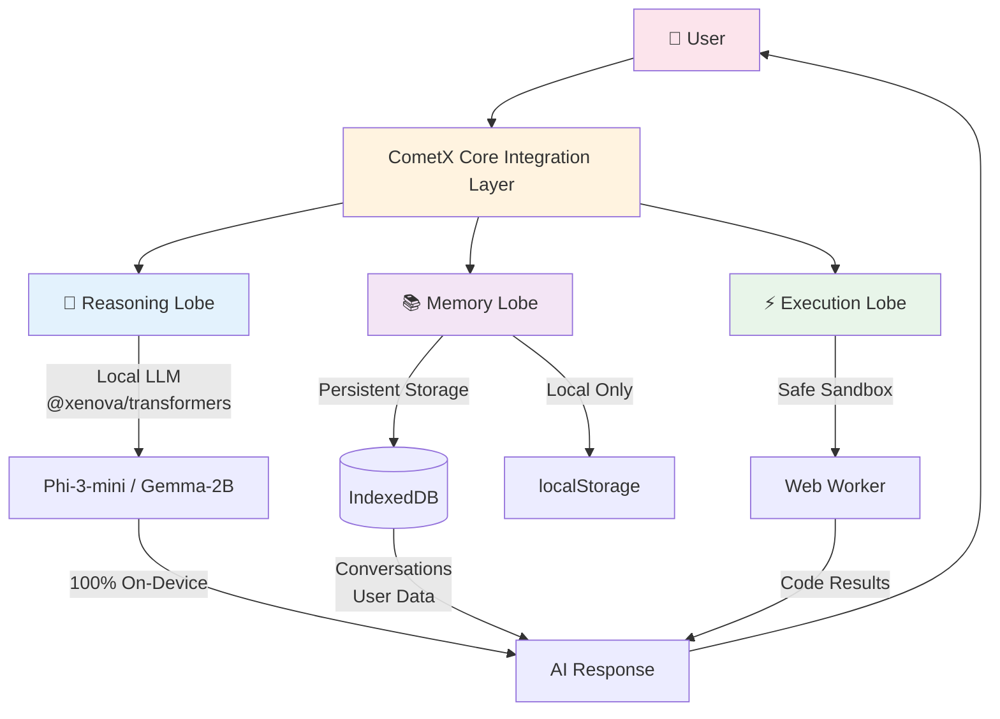

# CometX 🚀 - Sovereign AI Platform

<div align="center">

**Privacy-First • Local-First • Sovereign AI**

🇸🇦 Built for digital sovereignty and complete data privacy

[English](#english) | [العربية](#arabic)

</div>

---

## English

### Overview

CometX is a revolutionary sovereign AI platform that runs 100% locally on your device. Built with the innovative **Tri-Lobe Architecture**, CometX ensures your data never leaves your device while providing powerful AI capabilities.

### 🧠 Tri-Lobe Architecture

CometX's core is built on three independent but integrated "lobes" that work together to provide a complete AI experience:



#### 1. 🧠 Reasoning Lobe
- **Purpose**: Local AI inference and natural language understanding
- **Technology**: @xenova/transformers with WebGPU/WASM acceleration
- **Models**: Phi-3-mini (4k context) or Gemma-2B
- **Privacy**: 100% on-device, no cloud APIs
- **Features**:
  - Local language model inference
  - Context-aware responses
  - Support for Arabic and English
  - No internet required after initial model download

#### 2. 📚 Memory Lobe
- **Purpose**: Persistent local storage of conversations and user data
- **Technology**: IndexedDB with `idb` library
- **Privacy**: All data stored locally, never synced to cloud
- **Features**:
  - Conversation history management
  - User preferences (language, theme, model)
  - Efficient indexing for fast retrieval
  - Complete data control with clear-all functionality

#### 3. ⚡ Execution Lobe
- **Purpose**: Safe sandboxed code execution
- **Technology**: Web Workers with restricted scope
- **Safety**: Isolated execution environment, no access to sensitive APIs
- **Features**:
  - JavaScript/math expression evaluation
  - Console log capture
  - Timeout protection (5 seconds)
  - Safe Math operations
  - No access to DOM, network, or file system

### ✨ Features

- **🔒 Privacy-First**: All processing happens on your device. No data is ever sent to external servers
- **🌍 Multilingual**: Full support for Arabic (العربية) and English with RTL text support
- **💬 Chat Interface**: Natural conversation with AI assistant
- **📊 Dashboard**: Manage conversations, preferences, and data
- **⚡ Terminal**: Direct code execution in a safe sandbox
- **🎨 Modern UI**: Clean, responsive design with dark/light theme support
- **🚀 Fast**: WebGPU acceleration when available, WASM fallback
- **📱 Responsive**: Works on desktop, tablet, and mobile devices

### 🚀 Quick Start

#### Prerequisites
- Node.js 18 or higher
- Modern browser with IndexedDB support
- Optional: WebGPU-capable browser for faster inference

#### Installation

```bash
# Clone the repository
git clone https://github.com/ALKHOARZMI/cometx.git
cd cometx

# Install dependencies
npm install

# Start development server
npm run dev
```

The application will open at `http://localhost:5173`

#### First Time Setup

1. **Model Download**: On first launch, CometX will download the selected AI model (~2-4GB). This happens once and the model is cached locally.
2. **Choose Language**: Select Arabic (العربية) or English in the Dashboard
3. **Select Model**: Choose between Phi-3-mini (recommended) or Gemma-2B
4. **Start Chatting**: Begin a conversation in the Chat interface

### 📖 Usage

#### Chat Interface
- Type messages naturally in Arabic or English
- Use code blocks for execution: ` ```javascript ... ``` `
- Ask for calculations: "Calculate: 2 + 2"
- View execution results inline

#### Dashboard
- View all conversations
- Change language, theme, and AI model
- Clear all data for privacy

#### Terminal
- Execute JavaScript code directly
- Use built-in commands: `help`, `clear`, `history`
- Run math expressions: `Math.sqrt(16)`
- Create functions: `const add = (a,b) => a + b; add(5,3)`

### 🏗️ Project Structure

```
cometx/
├── src/
│   ├── lobes/
│   │   ├── reasoning.ts    # Reasoning Lobe (Local LLM)
│   │   ├── memory.ts       # Memory Lobe (IndexedDB)
│   │   └── execution.ts    # Execution Lobe (Web Worker)
│   ├── workers/
│   │   └── execution.worker.ts  # Safe code execution worker
│   ├── ui/
│   │   ├── chat.ts         # Chat interface
│   │   ├── dashboard.ts    # Dashboard interface
│   │   └── terminal.ts     # Terminal interface
│   ├── utils/
│   │   └── i18n.ts         # Internationalization utilities
│   ├── cometx.ts           # Core integration layer
│   ├── main.ts             # Application entry point
│   └── style.css           # Styles
├── index.html              # HTML entry point
├── package.json            # Dependencies
├── tsconfig.json           # TypeScript configuration
└── vite.config.ts          # Vite configuration
```

### 🔧 Development

```bash
# Install dependencies
npm install

# Start dev server with hot reload
npm run dev

# Build for production
npm run build

# Preview production build
npm run preview

# Lint code
npm run lint
```

### 🛡️ Security & Privacy

CometX is designed with privacy as the top priority:

- ✅ **No Cloud Dependencies**: All AI processing happens locally
- ✅ **No Analytics**: No tracking, no telemetry, no phone home
- ✅ **No External API Calls**: After model download, no internet required
- ✅ **Sandboxed Execution**: Code runs in isolated Web Worker
- ✅ **Local Storage Only**: IndexedDB, never synced
- ✅ **Clear Data Anytime**: One-click data deletion

### 🌐 Browser Compatibility

- **Recommended**: Chrome 113+, Edge 113+ (WebGPU support)
- **Compatible**: Firefox 115+, Safari 16+ (WASM fallback)
- **Required**: IndexedDB support

### 📦 Technologies

- **Frontend**: TypeScript, Vite
- **AI**: @xenova/transformers (Transformers.js)
- **Storage**: IndexedDB (idb library)
- **Workers**: Web Workers API
- **Models**: Phi-3-mini, Gemma-2B

### 🤝 Contributing

Contributions are welcome! Please feel free to submit a Pull Request.

### 📄 License

MIT License - see [LICENSE](LICENSE) file for details

### 🙏 Acknowledgments

- Xenova for transformers.js
- Microsoft for Phi-3 models
- Google for Gemma models
- The open-source AI community

---

## Arabic

<div dir="rtl" align="right">

### نظرة عامة

CometX هو منصة ذكاء اصطناعي سيادية ثورية تعمل بنسبة 100٪ محليًا على جهازك. مبنية على **معمارية ثلاثية الفصوص** المبتكرة، يضمن CometX عدم مغادرة بياناتك لجهازك مع توفير قدرات ذكاء اصطناعي قوية.

### 🧠 معمارية ثلاثية الفصوص

يتكون قلب CometX من ثلاثة "فصوص" مستقلة ولكنها متكاملة تعمل معًا لتوفير تجربة ذكاء اصطناعي كاملة:

#### 1. 🧠 فص التفكير (Reasoning Lobe)
- **الغرض**: الاستنتاج المحلي للذكاء الاصطناعي وفهم اللغة الطبيعية
- **التقنية**: @xenova/transformers مع تسريع WebGPU/WASM
- **النماذج**: Phi-3-mini أو Gemma-2B
- **الخصوصية**: 100٪ على الجهاز، بدون واجهات برمجية سحابية

#### 2. 📚 فص الذاكرة (Memory Lobe)
- **الغرض**: التخزين المحلي الدائم للمحادثات وبيانات المستخدم
- **التقنية**: IndexedDB مع مكتبة `idb`
- **الخصوصية**: جميع البيانات مخزنة محليًا، لا تُزامن أبدًا مع السحابة

#### 3. ⚡ فص التنفيذ (Execution Lobe)
- **الغرض**: تنفيذ آمن ومعزول للكود
- **التقنية**: Web Workers مع نطاق محدود
- **الأمان**: بيئة تنفيذ معزولة، بدون وصول إلى واجهات برمجية حساسة

### ✨ الميزات

- **🔒 الخصوصية أولاً**: كل المعالجة تحدث على جهازك. لا تُرسل أي بيانات إلى خوادم خارجية
- **🌍 متعدد اللغات**: دعم كامل للعربية والإنجليزية مع دعم النص من اليمين إلى اليسار
- **💬 واجهة المحادثة**: محادثة طبيعية مع مساعد الذكاء الاصطناعي
- **📊 لوحة التحكم**: إدارة المحادثات والتفضيلات والبيانات
- **⚡ الطرفية**: تنفيذ مباشر للكود في بيئة آمنة
- **🎨 واجهة مستخدم حديثة**: تصميم نظيف ومتجاوب مع دعم السمات الفاتحة والداكنة

### 🚀 البدء السريع

```bash
# استنساخ المستودع
git clone https://github.com/ALKHOARZMI/cometx.git
cd cometx

# تثبيت التبعيات
npm install

# بدء خادم التطوير
npm run dev
```

### 🛡️ الأمان والخصوصية

تم تصميم CometX مع إعطاء الأولوية للخصوصية:

- ✅ **بدون اعتماد على السحابة**: كل معالجة الذكاء الاصطناعي تحدث محليًا
- ✅ **بدون تحليلات**: لا تتبع، لا قياس عن بُعد
- ✅ **بدون استدعاءات API خارجية**: بعد تنزيل النموذج، لا حاجة للإنترنت
- ✅ **تنفيذ معزول**: الكود يعمل في Web Worker معزول
- ✅ **التخزين المحلي فقط**: IndexedDB، لا تُزامن أبدًا
- ✅ **مسح البيانات في أي وقت**: حذف البيانات بنقرة واحدة

### 📄 الترخيص

رخصة MIT - انظر ملف [LICENSE](LICENSE) للتفاصيل

</div>

---

<div align="center">

**🇸🇦 Made with ❤️ for Digital Sovereignty**

</div>